# LOCF ERD

아래 ERD는 현재 [03_create_locf_tables.sql](D:\sts-5.1.1.RELEASE\workspace\hi-locf\src\main\resources\db\oracle\03_create_locf_tables.sql) 기준의 테이블 구조를 Mermaid 형식으로 표현한 것입니다.

- 원천 테이블
  - `CUSTOMER_MASTER`
  - `LOAN_CONTRACT`
  - `LOAN_RATE`
  - `LOAN_REPAYMENT_SCHEDULE`
  - `LOAN_BALANCE`
- LOCF 배치/중간/결과 테이블
  - `LOCF_BATCH_EXECUTION`
  - `LOCF_BATCH_STEP_EXECUTION`
  - `LOCF_TARGET_CONTRACT`
  - `LOCF_CASHFLOW_BASE`
  - `LOCF_EIR_RESULT`
  - `LOCF_AMORTIZATION_DTL`
  - `LOCF_RESULT_HDR`
  - `LOCF_RESULT_SUMMARY`

```mermaid
erDiagram
    CUSTOMER_MASTER {
        NUMBER CUSTOMER_ID PK
        VARCHAR CUSTOMER_NO
        VARCHAR CUSTOMER_NAME
        VARCHAR CUSTOMER_TYPE
        VARCHAR SEGMENT_CODE
        VARCHAR STATUS_CODE
        TIMESTAMP CREATED_AT
        TIMESTAMP UPDATED_AT
    }

    LOAN_CONTRACT {
        NUMBER CONTRACT_ID PK
        VARCHAR CONTRACT_NO
        NUMBER CUSTOMER_ID FK
        VARCHAR PRODUCT_CODE
        VARCHAR LOAN_TYPE_CODE
        VARCHAR REPAYMENT_TYPE
        DATE EXECUTION_DATE
        DATE MATURITY_DATE
        NUMBER PRINCIPAL_AMT
        NUMBER FEE_AMT
        NUMBER DIRECT_COST_AMT
        VARCHAR STATUS_CODE
        TIMESTAMP CREATED_AT
        TIMESTAMP UPDATED_AT
    }

    LOAN_RATE {
        NUMBER RATE_ID PK
        NUMBER CONTRACT_ID FK
        VARCHAR RATE_TYPE
        NUMBER ANNUAL_NOMINAL_RATE
        DATE EFFECTIVE_FROM
        DATE EFFECTIVE_TO
        TIMESTAMP CREATED_AT
        TIMESTAMP UPDATED_AT
    }

    LOAN_REPAYMENT_SCHEDULE {
        NUMBER SCHEDULE_ID PK
        NUMBER CONTRACT_ID FK
        NUMBER INSTALLMENT_NO
        DATE PAYMENT_DATE
        NUMBER SCHEDULED_PAYMENT_AMT
        NUMBER SCHEDULED_PRINCIPAL_AMT
        NUMBER SCHEDULED_INTEREST_AMT
        TIMESTAMP CREATED_AT
        TIMESTAMP UPDATED_AT
    }

    LOAN_BALANCE {
        NUMBER BALANCE_ID PK
        NUMBER CONTRACT_ID FK
        DATE BASE_DATE
        NUMBER OUTSTANDING_PRINCIPAL_AMT
        NUMBER ACCRUED_INTEREST_AMT
        VARCHAR STATUS_CODE
        TIMESTAMP CREATED_AT
        TIMESTAMP UPDATED_AT
    }

    LOCF_BATCH_EXECUTION {
        NUMBER BATCH_EXECUTION_ID PK
        VARCHAR BATCH_RUN_NO
        DATE BASE_DATE
        VARCHAR BATCH_TYPE
        VARCHAR STATUS_CODE
        NUMBER TARGET_COUNT
        NUMBER PROCESSED_COUNT
        NUMBER ERROR_COUNT
        TIMESTAMP STARTED_AT
        TIMESTAMP FINISHED_AT
        VARCHAR ERROR_MESSAGE
    }

    LOCF_BATCH_STEP_EXECUTION {
        NUMBER STEP_EXECUTION_ID PK
        NUMBER BATCH_EXECUTION_ID FK
        VARCHAR STEP_NAME
        VARCHAR STATUS_CODE
        TIMESTAMP STARTED_AT
        TIMESTAMP FINISHED_AT
        NUMBER PROCESSED_COUNT
        VARCHAR ERROR_MESSAGE
    }

    LOCF_TARGET_CONTRACT {
        NUMBER TARGET_ID PK
        NUMBER BATCH_EXECUTION_ID FK
        NUMBER CONTRACT_ID
        VARCHAR CONTRACT_NO
        NUMBER CUSTOMER_ID
        VARCHAR PRODUCT_CODE
        VARCHAR REPAYMENT_TYPE
        NUMBER PRINCIPAL_AMT
        NUMBER FEE_AMT
        NUMBER DIRECT_COST_AMT
        NUMBER ANNUAL_NOMINAL_RATE
        DATE EXECUTION_DATE
        DATE MATURITY_DATE
        NUMBER TERM_IN_MONTHS
    }

    LOCF_CASHFLOW_BASE {
        NUMBER CASHFLOW_BASE_ID PK
        NUMBER BATCH_EXECUTION_ID FK
        NUMBER CONTRACT_ID
        VARCHAR CONTRACT_NO
        NUMBER INSTALLMENT_NO
        DATE PAYMENT_DATE
        NUMBER SCHEDULED_PAYMENT_AMT
        NUMBER SCHEDULED_PRINCIPAL_AMT
        NUMBER SCHEDULED_INTEREST_AMT
    }

    LOCF_EIR_RESULT {
        NUMBER EIR_RESULT_ID PK
        NUMBER BATCH_EXECUTION_ID FK
        NUMBER CONTRACT_ID
        VARCHAR CONTRACT_NO
        NUMBER INITIAL_CARRYING_AMOUNT
        NUMBER MONTHLY_EIR
        NUMBER ANNUAL_EIR
    }

    LOCF_AMORTIZATION_DTL {
        NUMBER AMORTIZATION_DTL_ID PK
        NUMBER BATCH_EXECUTION_ID FK
        NUMBER CONTRACT_ID
        VARCHAR CONTRACT_NO
        NUMBER INSTALLMENT_NO
        DATE PAYMENT_DATE
        NUMBER OPENING_PRINCIPAL_BAL
        NUMBER OPENING_CARRYING_AMT
        NUMBER SCHEDULED_PAYMENT_AMT
        NUMBER SCHEDULED_PRINCIPAL_AMT
        NUMBER SCHEDULED_INTEREST_AMT
        NUMBER EFFECTIVE_INTEREST_REVENUE
        NUMBER FEE_AMORTIZATION_AMT
        NUMBER COST_AMORTIZATION_AMT
        NUMBER NET_AMORTIZATION_AMT
        NUMBER CLOSING_PRINCIPAL_BAL
        NUMBER CLOSING_CARRYING_AMT
    }

    LOCF_RESULT_HDR {
        NUMBER RESULT_HDR_ID PK
        NUMBER BATCH_EXECUTION_ID FK
        DATE BASE_DATE
        NUMBER CONTRACT_ID
        VARCHAR CONTRACT_NO
        NUMBER CUSTOMER_ID
        VARCHAR PRODUCT_CODE
        NUMBER PRINCIPAL_AMT
        NUMBER INITIAL_CARRYING_AMOUNT
        NUMBER ANNUAL_EIR
        NUMBER FINAL_CARRYING_AMOUNT
        NUMBER TOTAL_EFFECTIVE_INTEREST_REV
        NUMBER TOTAL_FEE_AMORTIZATION_AMT
        NUMBER TOTAL_COST_AMORTIZATION_AMT
        TIMESTAMP CREATED_AT
    }

    LOCF_RESULT_SUMMARY {
        NUMBER SUMMARY_ID PK
        NUMBER BATCH_EXECUTION_ID FK
        DATE BASE_DATE
        VARCHAR PRODUCT_CODE
        NUMBER CONTRACT_COUNT
        NUMBER TOTAL_INITIAL_CARRYING_AMT
        NUMBER TOTAL_FINAL_CARRYING_AMT
        NUMBER TOTAL_EFFECTIVE_INTEREST_REV
        TIMESTAMP CREATED_AT
    }

    CUSTOMER_MASTER ||--o{ LOAN_CONTRACT : "has"
    LOAN_CONTRACT ||--o{ LOAN_RATE : "has"
    LOAN_CONTRACT ||--o{ LOAN_REPAYMENT_SCHEDULE : "has"
    LOAN_CONTRACT ||--o{ LOAN_BALANCE : "has"

    LOCF_BATCH_EXECUTION ||--o{ LOCF_BATCH_STEP_EXECUTION : "logs"
    LOCF_BATCH_EXECUTION ||--o{ LOCF_TARGET_CONTRACT : "targets"
    LOCF_BATCH_EXECUTION ||--o{ LOCF_CASHFLOW_BASE : "creates"
    LOCF_BATCH_EXECUTION ||--o{ LOCF_EIR_RESULT : "calculates"
    LOCF_BATCH_EXECUTION ||--o{ LOCF_AMORTIZATION_DTL : "amortizes"
    LOCF_BATCH_EXECUTION ||--o{ LOCF_RESULT_HDR : "aggregates"
    LOCF_BATCH_EXECUTION ||--o{ LOCF_RESULT_SUMMARY : "summarizes"

    LOAN_CONTRACT ||--o{ LOCF_TARGET_CONTRACT : "selected as"
    LOAN_CONTRACT ||--o{ LOCF_CASHFLOW_BASE : "generates"
    LOAN_CONTRACT ||--o{ LOCF_EIR_RESULT : "calculates"
    LOAN_CONTRACT ||--o{ LOCF_AMORTIZATION_DTL : "produces"
    LOAN_CONTRACT ||--o{ LOCF_RESULT_HDR : "results"
```

## 읽는 기준

- `CUSTOMER_MASTER -> LOAN_CONTRACT -> LOAN_RATE / LOAN_REPAYMENT_SCHEDULE / LOAN_BALANCE`
  - 운영계 원천 구조
- `LOCF_BATCH_EXECUTION`
  - 배치 실행 1건의 헤더
- `LOCF_BATCH_STEP_EXECUTION`
  - 배치 내부 step 실행 이력
- `LOCF_TARGET_CONTRACT`
  - 기준일자에 실제 LOCF 산출 대상이 된 계약
- `LOCF_CASHFLOW_BASE`
  - 계약별 약정 현금흐름
- `LOCF_EIR_RESULT`
  - 계약별 EIR 계산 결과
- `LOCF_AMORTIZATION_DTL`
  - 회차별 상각 상세
- `LOCF_RESULT_HDR`
  - 계약별 최종 헤더
- `LOCF_RESULT_SUMMARY`
  - 상품코드 기준 요약 결과

## 관련 파일

- [03_create_locf_tables.sql](D:\sts-5.1.1.RELEASE\workspace\hi-locf\src\main\resources\db\oracle\03_create_locf_tables.sql)
- [locf-practical-design.md](D:\sts-5.1.1.RELEASE\workspace\hi-locf\docs\locf-practical-design.md)
- [locf-implementation-blueprint.md](D:\sts-5.1.1.RELEASE\workspace\hi-locf\docs\locf-implementation-blueprint.md)
