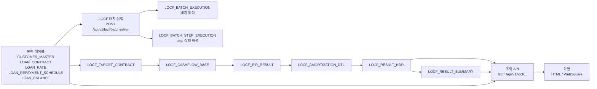
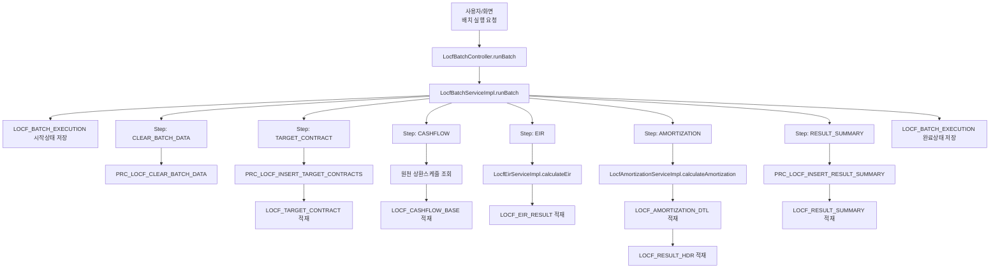
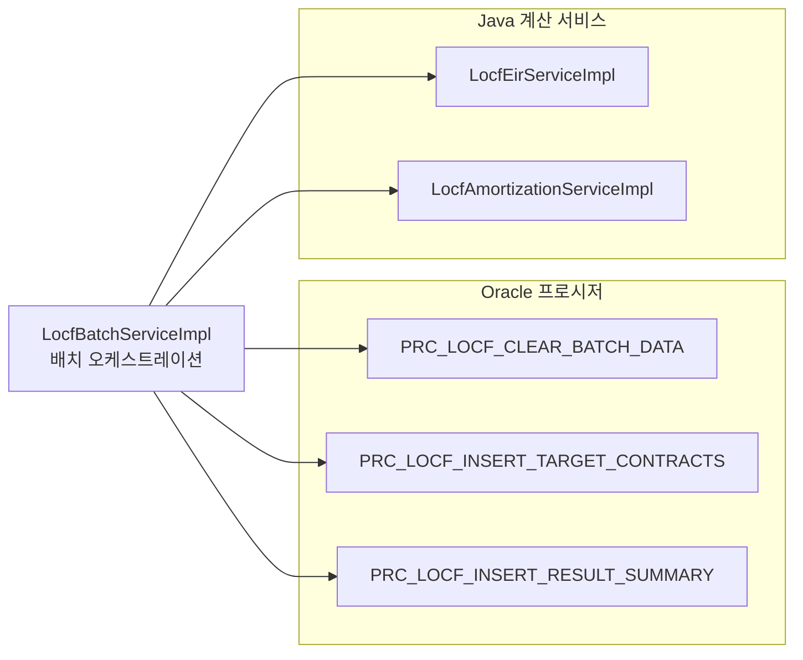
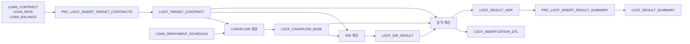
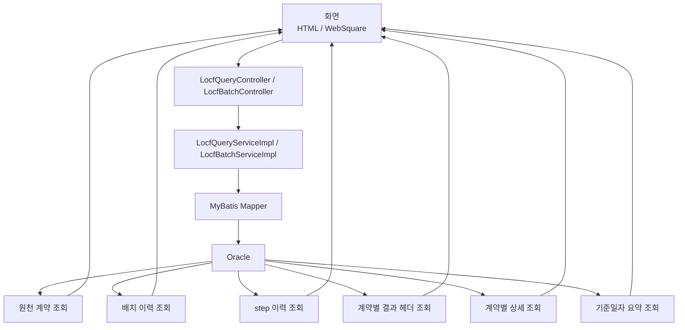
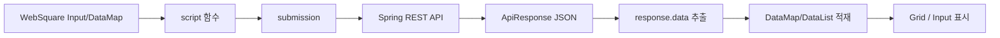
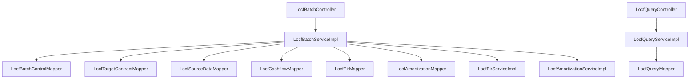

# LOCF 전체 프로세스 다이어그램

## 목적
이 문서는 `hi-locf` 프로젝트의 전체 흐름을 다이어그램 중심으로 정리한 문서다.

학습 포인트는 4가지다.
- 원천 데이터가 어디서 시작하는지
- 배치 실행 시 어떤 step 순서로 흘러가는지
- 어떤 부분이 프로시저이고 어떤 부분이 Java 계산인지
- 조회 API / 화면(WebSquare, HTML)이 결과를 어떻게 읽는지

문서 기준 DTO/VO 규칙:
- Controller 응답 객체는 JavaBean POJO 형태의 DTO/VO를 사용한다.
- `ApiResponse<T>` 내부의 `data`도 getter/setter를 가진 JavaBean 객체로 내려간다.

---

## 1. 전체 구조



의미:
- 원천 테이블은 입력이다.
- LOCF 배치가 실행되면 중간/결과 테이블이 순차적으로 채워진다.
- 조회 API는 원천/결과 테이블을 읽어 화면으로 JSON을 내려준다.

---

## 2. 배치 실행 상세 흐름



핵심:
- `CLEAR_BATCH_DATA`, `TARGET_CONTRACT`, `RESULT_SUMMARY`는 프로시저 호출
- `CASHFLOW`, `EIR`, `AMORTIZATION`은 Java 서비스 계산

---

## 3. 프로시저와 Java 역할 분리



### Oracle 프로시저 담당
- 중간/결과 데이터 정리
- 원천 계약 대상 추출
- 결과 요약 집계

### Java 서비스 담당
- 월 EIR 계산
- 현재가치 계산
- 회차별 상각 상세 계산
- step 순서 제어
- 배치 이력/오류 처리

---

## 4. Step별 입출력 테이블



정리:
- 대상 계약은 원천 계약/금리/잔액에서 온다.
- 현금흐름은 원천 상환스케줄에서 온다.
- EIR은 대상 계약 + 현금흐름을 사용한다.
- 상각은 대상 계약 + 현금흐름 + EIR 결과를 사용한다.
- 요약은 결과 헤더를 집계한다.

---

## 5. 조회 흐름



### 주요 조회 API
- `GET /hi-locf/api/v1/locf/source-contracts`
- `GET /hi-locf/api/v1/locf/batches`
- `GET /hi-locf/api/v1/locf/batches/{batchRunNo}/steps`
- `GET /hi-locf/api/v1/locf/contracts/{contractNo}`
- `GET /hi-locf/api/v1/locf/results/summary?baseDate=...`

---

## 6. WebSquare 기준 흐름



학습 포인트:
- WebSquare는 `DataMap`, `DataList`를 중심으로 움직인다.
- submission은 URL 호출 정의다.
- 응답 JSON 전체를 바로 그리드에 넣는 게 아니라 `response.data`를 꺼내 dataset에 담는다.

관련 파일:
- [locf-sample.xml](D:\sts-5.1.1.RELEASE\workspace\hi-locf\src\main\resources\static\websquare\locf-sample.xml)
- [locf-websquare-walkthrough.md](D:\sts-5.1.1.RELEASE\workspace\hi-locf\docs\locf-websquare-walkthrough.md)

---

## 7. 실제 클래스 연결



이 그림은 "어떤 서비스가 어떤 Mapper/계산 서비스를 쓰는가"를 보여준다.

---

## 8. 학습 순서 추천

### 1단계
- [03_create_locf_tables.sql](D:\sts-5.1.1.RELEASE\workspace\hi-locf\src\main\resources\db\oracle\03_create_locf_tables.sql)
- 원천/중간/결과/프로시저 구조 확인

### 2단계
- [LocfBatchController.java](D:\sts-5.1.1.RELEASE\workspace\hi-locf\src\main\java\com\hi\locf\feature\locf\controller\LocfBatchController.java)
- [LocfBatchServiceImpl.java](D:\sts-5.1.1.RELEASE\workspace\hi-locf\src\main\java\com\hi\locf\feature\locf\service\LocfBatchServiceImpl.java)
- 배치 step 순서 확인

### 3단계
- `PRC_LOCF_CLEAR_BATCH_DATA`
- `PRC_LOCF_INSERT_TARGET_CONTRACTS`
- `PRC_LOCF_INSERT_RESULT_SUMMARY`
- DB 프로시저 담당 영역 확인

### 4단계
- [LocfEirServiceImpl.java](D:\sts-5.1.1.RELEASE\workspace\hi-locf\src\main\java\com\hi\locf\feature\locf\service\LocfEirServiceImpl.java)
- [LocfAmortizationServiceImpl.java](D:\sts-5.1.1.RELEASE\workspace\hi-locf\src\main\java\com\hi\locf\feature\locf\service\LocfAmortizationServiceImpl.java)
- Java 계산 로직 확인

### 5단계
- [LocfQueryController.java](D:\sts-5.1.1.RELEASE\workspace\hi-locf\src\main\java\com\hi\locf\feature\locf\controller\LocfQueryController.java)
- [LocfQueryServiceImpl.java](D:\sts-5.1.1.RELEASE\workspace\hi-locf\src\main\java\com\hi\locf\feature\locf\service\LocfQueryServiceImpl.java)
- 조회 API 확인

### 6단계
- [locf-sample.html](D:\sts-5.1.1.RELEASE\workspace\hi-locf\src\main\resources\static\locf-sample.html)
- [locf-sample.xml](D:\sts-5.1.1.RELEASE\workspace\hi-locf\src\main\resources\static\websquare\locf-sample.xml)
- 화면 연계 확인

---

## 9. 한 줄 정리
이 프로젝트의 전체 프로세스는 다음과 같이 이해하면 된다.

```text
원천 데이터
-> 배치 실행
-> 프로시저/Java 계산 혼합 처리
-> 중간/결과 테이블 적재
-> 조회 API
-> HTML / WebSquare 화면 표시
```
