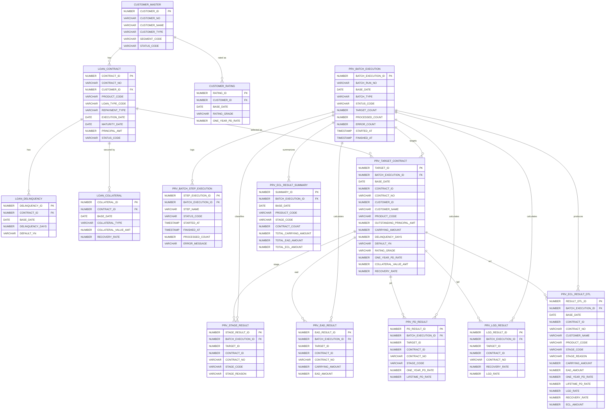

# Provision ERD

아래 ERD는 현재 [04_create_provision_tables.sql](D:\sts-5.1.1.RELEASE\workspace\hi-locf\src\main\resources\db\oracle\04_create_provision_tables.sql) 기준의 충당금 테이블 구조를 Mermaid 형식으로 표현한 것입니다.

- 공통 원천 테이블
  - `CUSTOMER_MASTER`
  - `LOAN_CONTRACT`
- 충당금 보강 원천 테이블
  - `CUSTOMER_RATING`
  - `LOAN_DELINQUENCY`
  - `LOAN_COLLATERAL`
- 충당금 배치/중간/결과 테이블
  - `PRV_BATCH_EXECUTION`
  - `PRV_BATCH_STEP_EXECUTION`
  - `PRV_TARGET_CONTRACT`
  - `PRV_STAGE_RESULT`
  - `PRV_EAD_RESULT`
  - `PRV_PD_RESULT`
  - `PRV_LGD_RESULT`
  - `PRV_ECL_RESULT_DTL`
  - `PRV_ECL_RESULT_SUMMARY`

## 읽는 기준

- `CUSTOMER_MASTER`, `LOAN_CONTRACT`
  - 공통 운영계 원천
- `CUSTOMER_RATING`, `LOAN_DELINQUENCY`, `LOAN_COLLATERAL`
  - 충당금 산출에 필요한 보강 원천
- `PRV_BATCH_EXECUTION`
  - 충당금 배치 실행 1건 헤더
- `PRV_BATCH_STEP_EXECUTION`
  - Stage/EAD/PD/LGD/ECL 단계별 실행 이력
- `PRV_TARGET_CONTRACT`
  - 기준일자에 실제 충당금 산출 대상이 된 계약
- `PRV_STAGE_RESULT`
  - 계약별 Stage 판정 결과
- `PRV_EAD_RESULT`
  - 계약별 EAD 산출 결과
- `PRV_PD_RESULT`
  - 계약별 1년/평생 PD 결과
- `PRV_LGD_RESULT`
  - 계약별 회수율/LGD 결과
- `PRV_ECL_RESULT_DTL`
  - 계약별 최종 ECL 결과
- `PRV_ECL_RESULT_SUMMARY`
  - 기준일자/상품/Stage 단위 요약 결과

## 관련 파일

- [04_create_provision_tables.sql](D:\sts-5.1.1.RELEASE\workspace\hi-locf\src\main\resources\db\oracle\04_create_provision_tables.sql)
- [provision-websquare-walkthrough.md](D:\sts-5.1.1.RELEASE\workspace\hi-locf\docs\provision-websquare-walkthrough.md)
- [locf-process-diagram.md](D:\sts-5.1.1.RELEASE\workspace\hi-locf\docs\locf-process-diagram.md)
